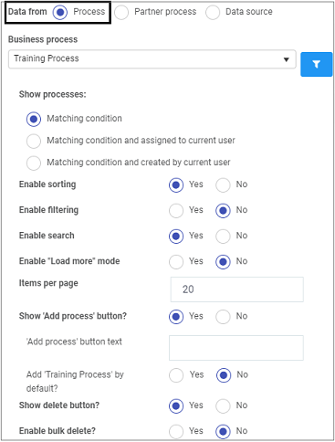
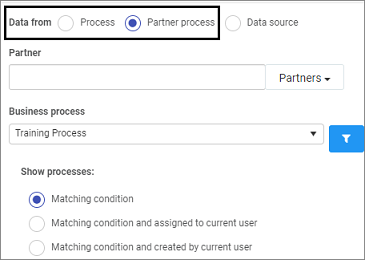
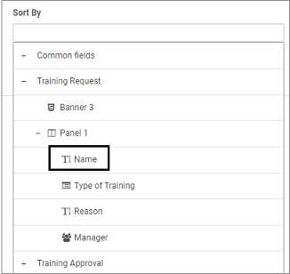

# Editing a dashboard #

When using a predefined dashboard widget, there are many options to enabling filtering, match conditions, and only display certain fields from processes, so you can hone in on the data you need.

## How to get started ##

1. Click on the **Pen** icon in a widget you have created, for example a List widget as shown below.

2. A dialog box opens with filtering options in the left-hand pane and list view fields in the right-hand pane, go to [List view fields](#list-view-fields) to read more about the latter options.

   

3. The first option to choose is where the data should originate from using the **Data from** radio buttons. Choose from a) Process b) Partner process c) Data source. Depending on which option you choose go to the relevant area to read more on [Choosing data from a Process](#choosing-data-from-a-process), [Choosing data from a Partner process](#choosing-data=from-a=partner-process) and [Choosing data from a Data source](#choosing-data-from-a-data-source).

4. Once a data source is chosen, then there are a number of other options available, see [Filter options](#filter-options).

   

### Choosing data from a Process ###

If you choose data from a Process, then the options below become available.

1. Choose from the following options:
   - **Business process** - click into the field to choose a process which will be the input for the dashboard.
   - **Show processes** - choose from a) Matching condition b) Matching condition and assigned to current user c) Matching condition and created by current user - TO COME BACK TO
   - For all other available options see [Filter options](#filter-options).

### Choosing data from a Partner Process ###

If you choose data from a Partner Process, then the options below become available.

1. Choose from the following options:
   - **Partner** - click into the field to choose from a pre-configured Partner who has created the process you are interested in.
   - **Business process** - click into the field to choose a process which will be the input for the dashboard.
   - **Show processes** - choose from a) Matching condition b) Matching condition and assigned to current user c) Matching condition and created by current user - TO COME BACK TO
   - For all other available options see [Filter options](#filter-options).

### Choosing data from a Data source ###

If you choose data from a Data source, then the options below become available.

1. Click on **Select data source**

1. Click on **Data source filter**

1. For all other available options see [Filter options](#filter-options).

   

### Filter options ###
Once you have chosen where the dashboard data will come from then there are a number of other options available: 

- **Enable sorting** - choose from a) Yes or b) No if you wish to enable sorting in the dashboard

- **Enable filtering** - choose from a) Yes or b) No if you wish to enable filtering in the dashboard

- **Enable search** - choose from a) Yes or b) No if you wish to enable a search in the dashboard

- **Enable "Load more" mode** - choose from a) Yes or b) No if you wish to enable more data records to be visible. If you click on **Yes**, then you can decide on what text should appear on screen, by typing the text in the **Load more button text** field.

  

  Enter a number in **Items per page** for the number items you wish to load at a time. The default value is '20'.

- **Show 'Add process' button** - choose from a) Yes or b) No if you wish to Add process to your dashboard. TO COME BACK TO If you click on **Yes**, then you can decide on what text should appear on screen, by typing the text in the **'Add process' button text** field. 

  

  By default, the process used to generate the data is added, click on **No** beside the Add 'Process Name' by default if you don't wish to add the input process.

- **Show delete button** - choose from a) Yes or b) No if you wish to add a Delete button to your dashboard. If you choose **Yes**, then the option **Enable bulk delete** appears allowing you to choose a) Yes or b) No to enable bulk deletion of records.

- **Enable show history** - choose from a) Yes or b) No if you wish to show the history of the dashboard.

- **Enable data export** - choose from a) Yes or b) No if you wish to allow data export.

- **Sort by** - click into the Sort By field and choose from options a) Common fields or b) fields within a form.

  **Common fields** are fields commonly used in dashboards such as 'Created' or 'Status' or choose from a field within a form by clicking and drilling down to the field name that you want to sort by, for example a text box field called 'Name' in a form called 'Training Request'.

  

  When a field is chosen then the options for **Sort Direction** appear as either a) Ascending or b) Descending.

- Then by - TO COME BACK TO

- **Enable empty list template** - click on a) Yes or b) No to enable TO COME BACK TO.

