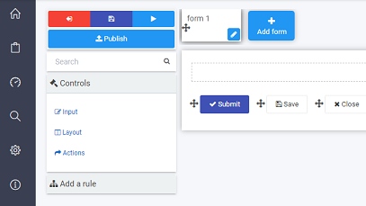

# Controls

**Controls** are predefined field widgets that allow you to add specific elements to your forms and processes such as lists, text boxes and tables. There are 16 controls you can add to a form, see [Controls list](#controls-list).

If you have developer skills,  you can create your own custom field widget, see [Development](development/Readme.md) for more information.

## Getting started with Controls ##

If you go to **Administration** > **Designer** and click on a process or create a new process, the predefined fields are found in the left-hand pane.

There are 3 categories of fields:

1. **Input** - There are 8 Input fields and they include the most common data fields such as textbox, user picker, date field, table, checkbox, drop-down and number fields, see [Input](input/ReadMe.md) for more information. 
2. **Layout** - There are 4 Layout fields that serve the purpose of perfecting the layout of your form. They include responsive panels, dialog box, field groups and rich text fields, see [Layout](layout/Readme.md) for more information.
3. **Action** - There are 4 Action fields that allow user interface actions like buttons, links or even signature components, see [Actions](actions/Readme.md) for more information.

All fields will have edit options when you start creating the field, as well as field properties that you can edit. Each field can also have rules applied to it. 

## Controls list ##

A full list of controls is available in the table below.

