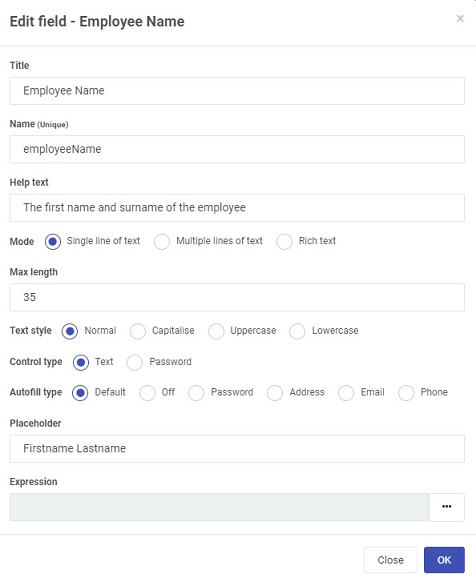

# Text box field

The **Text box field** is used to input text into a form for example a name or address. There are various options available when creating this field, these are explained below.

## How to get started
**How to add a text box to a form - a sample video**

<video title="How to add a text box to a form" width="100%" style="width:100%" controls="controls">
    <source src="/videos/textbox.mp4" type="video/mp4">
</video>

1. To add the Text box to your form click on **Controls** > **Input** > **Text box**. The text box can also be placed within an element for example a panel, by clicking on the panel itself and then add the text box. Compare in the image below, the text box Name which is inside a panel versus Reason for the request which is outside the panel, both in the form Employee Request.

   

2. To edit the Text box, click on the field itself and the **Pen** button  appears allowing you to edit the field.

   

3. Choose from the edit options:

   1. **Title** - of the field, for example Employee Name

   2. **Name** - this is a unique name for the field

   3. **Help text** - information to help the form user

   4. **Mode** - options are a) Single line of text b) Multiple lines of text c) Rich text

      If you choose a) Single line of text then the following additional options are visible:

      ​		**Control type** - options are a) Text b) Password

      ​		**Autofill type** - options are a) Default b) Off c) Password d) Address e) Email f) Phone

      ​		**Placeholder** - placeholder text that can help the user to know what to fill out in the text box

      If you choose b) Multiple lines of text then the following additional options are visible:

      ​		**Control type** - options are a) Text b) Password

      ​		**Autofill type** - options are a) Default b) Off c) Password d) Address e) Email f) Phone

      ​		**Placeholder** - placeholder text that can help the user to know what to fill out in the text box

      ​		**Rows** - the number of rows you would like for the text box

   5. **Text style** - options are a) Normal b) Capitalise c) Uppercase d) Lowercase

   6. **Max length** - the maximum number of characters for the field

   7. **Text style** - options are a) Normal b) Capitalise c) Uppercase d) Lowercase

   8. **Expression** - this can be used to return a value for example Date() returns the current date and time. For a full explanation of expressions go to [Expressions](platform/expressions.md) 

     

4. Click on the **OK** button  when you are finished editing the field to save your changes or click on **Close** to exit the dialog box without saving.

4. To move the text box, click on the **Drag handle** on the text box field itself and drag it to where you want it to appear on the form, for example within a panel. 

5. To save your changes to the form, click on the **Save** button . 

7. To delete the text box, click on the field itself and then click on the **Bin/Trash** button  and then click on **Ok** after you have reviewed the field name and are sure this is what you want to delete. Click on **Cancel** if you wish to cancel the deletion.

   

## How to edit Text box properties

To change the text box properties, click on the field itself and the properties pane appears on the right.

The **Field type**, Text box, is shown along with the **Title** of the field, in the example above Employee Name.

The options within properties are:

- **Show Title** - show the title of the field
- **Required** - make this field mandatory for users to fill out
- **Enabled** - the field is enabled for users to fill out
- **Visible** - the field is visible to users
- **Max length** - the maximum number of characters for the field
- **Layout** - change the width of the field by clicking on the bar in the Layout box until you see the desired size. Click on the arrow beside Layout to see the Mobile Layout and click on the bar to change the width of the text box for mobile use.

- **Rules** - rules for input fields are covered in [Rules](rules/README.md).

