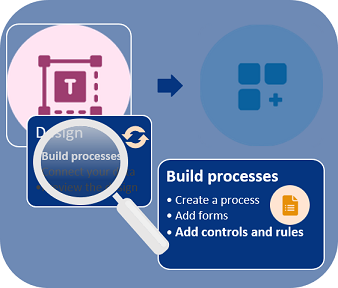
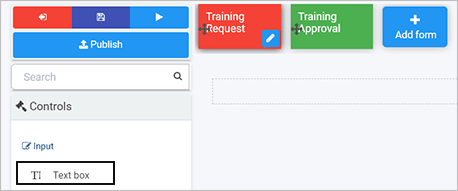
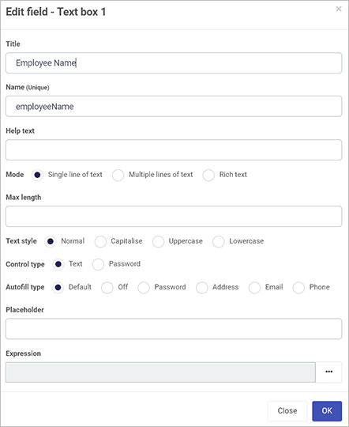
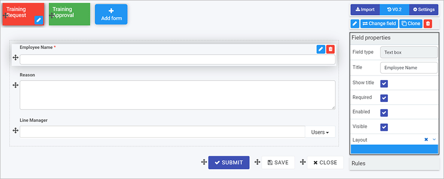
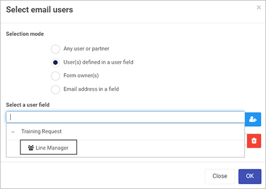
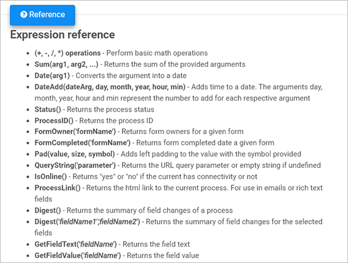
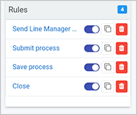
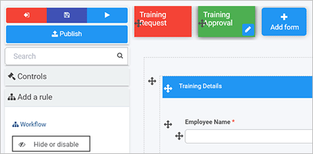
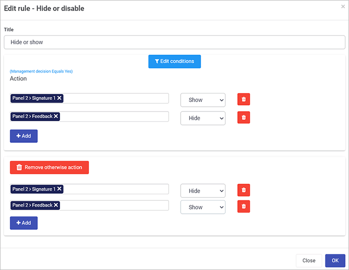

# Add controls and rules #

When you have created forms, then you are ready to add elements to those forms, that is **controls** and **rules**. This is the third step in building a process.

***Build process steps***

As you add elements to your form, you can save **drafts**. This allows you make changes and restore to earlier versions if needed, see [Version History](getting-started/version_history.md) for more information.

## Before you begin  

To add elements to your form, you need to reference your [process plan](getting-started/plan_process.md) and consider **what fields** you need and any **rules** that need to be applied to these fields. We will keep our Training Process [requirements](getting-started/plan_process.md#summary-of-requirements) in mind as we go.

In our example, in the Training Request Form we have 6 control fields to add: 2 text boxes, 1 user picker field, 2 buttons, 1 list field, and one rule to send an email. 

We will start with:

- [adding controls](#adding-a-first-control-text-box) or fields to our form, starting with an example of a text box

- editing [field properties](#field-properties)

- then [add rules](#adding-rules) where we will show two examples

  

## How to get started

There are 3 categories of Controls, and 10 categories of Rules, see [Controls](/getting-started/controls.md) and see [Rules](/getting-started/rules.md) for a full listing of what is available. 

Controls and rules are available from the left-hand pane in when you click into a process.

***Controls and Rules in left-hand pane***

**Note:** By default there are 3 buttons automatically added to forms - **Submit,** **Save** and **Close**, see form canvas in the image above.

- To remove a button or other field, click on the item and then click on the **Bin/Trash** button  then click on **OK** to confirm removal. 
- To move a button, or other field, click on the **Drag handle** button .
- To start adding controls or rules to a form, click on a form of choice so the as the **Pen** button   is visible.

## Adding a first control text box ##

The first field we are going to add in our example is a textbox field to accept user input. 

1. Click on a form that you want to edit, for example by clicking on the Training Request Form, the **Pen** button   is visible, meaning this form is in edit mode.

2. Click on **Controls** in the left-hand pane. Click on a particular category, for example **Input** and then click on a particular field type to add, for example **Text box**.

   

3. The field is added to the form. To edit the field, click on the field so the **Pen** button   is visible.

   ***Edit field***

   

4. Fill out the details in the **Edit field** dialog box - that is **Title**, **Name**, and choose options further options like **Mode** to have users input a **single line of text**, **multiple lines of text** or **rich text**. 

   ***Edit field dialog box***

   

   There are other options like **Text style** where you can choose to Capitalise or have lowercase text only. Click on **OK** button  when complete.

5. Repeat the steps above to add another textbox, or other field. We can add another text box field called 'Reason' for our Request Form. We can also add a **User Picker** field.

6. Click on **Controls** > **Input** > **User picker**. Choose from the options in the **New field - User picker** dialog box.  Click on **OK** button  when complete.

   ***New field - User picker dialog box***

   

   The user picker field will be used in this example, to allow the form user to pick from a list of users. This could be a pre-defined group, or individual users. The user picker field could also be connected to an external datasource like a list of line managers from SalesForce. 

6. Edit field properties as necessary to control how fields appear, see the next section Field properties.  

The video below highlights how to edit forms, and the section [Field properties](#field-properties.md) runs through the the editing process in steps.

***Editing forms***

<video width="100%" style="width:100%" controls>
    <source src="../videos/editfields.mp4">
    Your browser does not support the video tag.
    </source>
</video>

### Field properties

In addition to editing options when you add a field, you can also change field properties to impact form design.

***Kianda Designer introduction***

To edit field properties:

1. Click on a field so the **Pen** button   is visible. Field properties are available in the right-hand pane.

   ***Properties in the right-hand pane***

   

2. Tick checkboxes as appropriate, for example ticking **Enabled** means users can fill out the field. **Layout** is used to set the width of the field for both desktop and mobile layouts. In the example above, **Required** is checked which means that the particular textbox field 'Employee Name' is mandatory for users to fill out. This is denoted by asterix * beside the field name. Go to [Properties](getting-started/properties.md) to find out more about properties.

   Being aware of these options will help you to customise your form and impact the way it works. 

   You are now ready to [add rules](#adding-a-first-rule-called-send-email) to create smart, interactive forms.
   
   

### Adding rules ###

Rules allow actions based upon conditions resulting  from user interaction with fields. This creates smart, dynamic forms that follow business logic, all without the need for coding. 

The video below highlights how to get started with rules, and the section [Using a Communication rule](#using-a-communication-rule-send-email) runs through an example of how to add a communications rule to a form.

***Getting started with rules***

<video width="100%" style="width:100%" controls>
    <source src="../videos/rules.mp4">
    Your browser does not support the video tag.
    </source>
</video>

### Using a Communication rule Send email ###

In our example we will add a rule to **send an automated email** to a Line manager to approve a request based on a user completing the Training Request form and clicking on **Submit**. 

1. Click on the **Submit** button to edit the button.

2. Click on **Rules** in the right-hand pane. By default there are three rules already applied to the **Submit** button, to **Submit**, **Save** and **Close** the process when the Submit button is clicked.

   ***Rules for the Submit button***

   

3. To create an automated email rule, click on **Add a rule** > **Communications** > **Send email** in the right-hand pane.

	***Add Send email rule***

	

4. In the **Edit rule - Send email** dialog box, fill out the **Title**, and decide who are the email users, that is who the email will be **From**, **To**, any **CC** or **BCC** that should be included. Click on the **User** button  to add users to each field.

   ***Selecting a user field***

   

   **Note:** If you leave the **From** field blank, then the email will arrive from "noreply@kianda.com".

   For user fields like **To** and **CC**, there are various options to choose from . When you click on the **User** button  choose a selection mode to choose a user, for example **User(s) defined in a user field** will allow you to use a field from a form. When you click in the field below **Select a user field** drill down to the field you want, in this example Line Manager. This means when the user submits a form and chooses their Line Manager, an automated email will go to that Line Manager.

5. Fill out the **Subject** and **Body** text. You can use the **Expression builder** to add expressions to the body to personalise the email. 

   - Click on the field **Add field to expression** to drill down to the field you want, in this example Employee Name.

     ***Expression builder***

   	

   - Click on **Add to expression**. **Note:** Make sure you position your cursor in the correct place in the body of the email before you **Add field to expression** so that the expression is added in the correct place.

   - Click on **OK**.

     ***Expression added to an email body***

     

   - Other expressions can be added that use values or status of processes, for example to create a link to review a process, use the ProcessLink() expression. Click on **Expression builder** and **Reference** to get a list of 16 expressions you can use. **Note:** Click on the field under **Add field to expression** to clear the field so that you can add a reference.

     ***Expression references***
     
     
     
     Copy and paste an Expression reference, for example ProcessLink() into the box under **Expression**. This will create a link to a process. 
     
     Using the ProcessLink() expression, text can be entered into the brackets to provide a clickable link in the email as follows:
     
     
     
     In our example the email will contain a link, linked to this process, that the Line Manager can click on, so they can approve the request.

6. Use font and styling options in the body text to set the format of the email. Click on **OK** when complete.

7. The rule is created. Click on the rule in the right-hand pane and drag it to the top of the rule list, to change the **order of execution** so that the automated email is sent out first when a user clicks on 'Submit'.

   ***Changing the order of rule execution***

   

​		For more information on other rules that can be applied, go to [Rules](getting-started/rules.md) for a full listing of what is available.

8. Make sure to save your work as you go by clicking on the **Save** button.

9. Repeat the steps above to add another email rule to another field, or try other rule, for example a [Workflow rule](#adding-a-second-workflow-rule-called-Hide-and-Disable) as shown below.

   

### Adding a second Workflow rule called Hide and Disable

In the Training Process example, there is a second form that is part of this process, called Training Approval. From our Training Process [requirements](getting-started/plan_process.md#summary-of-requirements) the Approval form will have 7 fields, and 1 rule. The fields include a field group, a banner and a list and a **Workflow**  added to a radio list called 'Management decision'. The added **Workflow** rule is called **Hide and Disable**, so based on user input, if someone clicks 'Yes' for the 'Management decision, then a Signature field is shown to sign off on the form, if 'No' is clicked then the Signature field is hidden and a text box called 'Reason' is shown. 

1. Select a field in a form to apply the rule to, in this example a field called 'Management Decision' in a Training Approval field.

2. To use a Workflow rule, click on **Add a rule** > **Workflow** > **Hide and Disable** in the right-hand pane.

   ***Add Hide and Disable rule***

   

3. In the **Edit rule - Hide or Disable** dialog box, fill out the **Title**, in this example 'Hide or Show', then click on **Edit conditions**.

4. Click on **Add a conditions group**. First we need to a) **create a condition**, click into the first field and drill down to the field in the form you want to base an action on, in this example, 'Management decision', then click on the operator field, in this case we choose **Equals** and in the third value field type in one of the **possible values** for this field, in this example 'Yes'. Then click on **OK**.

   

   **Note:** There are 13 possible operators to choose from: **Equals**, **Not equals**, **Contains**, **Greater than**, **Greater or equal**, **Less than**, **Less or equal**, **Is blank**, **Not blank**, **Matches pattern**, **Does not match pattern**, **Is Visible**, **Is Enabled**.

5. In the **Edit rule** dialog box, that the first part of the condition appears see blue text 'Management Decision Equals Yes'. We then need to b) **create an action** for the condition. Click on the field under **Action** and drill down to a field within a form, in this example the Signature field in the form Training Approval. Then click on the arrow beside the action to choose, in this example **Show**. 

   

   **Note**: there are 7 possible actions in this list: **Hide**, **Show**, **Disable**, **Enable**, **Toggle visible**, **Toggle enable**, **Hide and clear**.

6. Click on **Add** to add a second part to the action, in this example to hide the feedback field upon a Management Decision of 'Yes'. Click on the first field and drill down to the field of interest, in this example 'Feedback' which we will then 'Hide'.

   

7. Click on **Add otherwise action**, in this example to add the actions based on a 'Management Decision' of 'No'.

  Drill down to the fields of choice, and click on the actions to add the reverse of the first action group.

  

8. Click on **OK** when complete.

Depending on the fields you use, for example user picker or lists, you can [**connect to a datasource**](getting-started/dataconnect.md) to ensure information used in forms is always up to date. Click on the link to find out how to add a datasource and use it in a form field, for example a list.

### What's next   ###

The next steps are: 

- [**Connect your data**](getting-started/dataconnect.md)
- [**Preview the design**](getting-started/previewer.md)

### User tips  ###

1. Make sure that you change the field properties to make fields **Required**, **Enabled** and so on, to ensure that the form appears the way you want, see [Properties](getting-started/properties.md) to find out more about properties. For example unchecking **Enabled** makes the field visible but not possible to edit. 
2. By default there are 3 buttons with every form, Submit, Save and Close. To remove a button, simply click on it and then click on the **Bin/Trash** button  or to add a new button of choice, go to **Controls** > **Actions** > **Button** see [Controls](/getting-started/controls.md) for a full list of controls.
3. There are additional form settings that can be used, available in the right-hand pane of **Designer**. Click on a form in the process, then click on the **Settings** button  to set additional settings such as **Enable process security**. This value can be checked and a group selected, so that only these users can access the form. Groups are added from **Side menu** > **Administration** > **Users**, click on **Create new group** to add users to a group, for example HR Team.
4. There are many ways to then reuse elements within forms, for example using the Group field and cloning, see the video [**How to reuse forms**](getting-started/how_to.md#how-to-reuse-forms).
5. To consider different ways of user inputs, see the video [**Possibilities for user input with Kianda**](getting-started/how_to.md#possibilities-for-user-input-with-kianda).
6. There are many ways to manage who has access to a process, or form, see the video [**How to manage user access**](getting-started/how_to.md#how-to-manage-user-access).

### **To return to the previous pages click on the links below**   

- [**Design and build your process**](getting-started/design_process.md) 
- [**Designer**](getting-started/designer.md)
- [**Add forms**](getting-started/create_form.md)

  

   