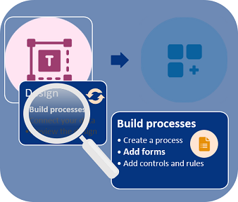
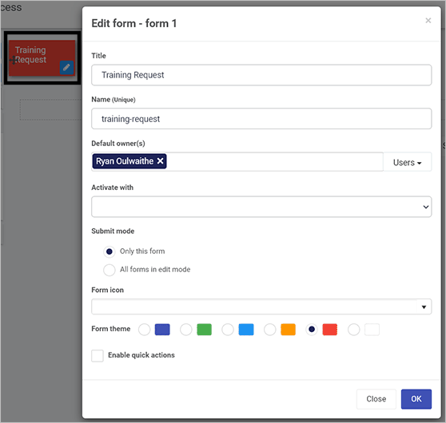

# Add forms #

After you have created a process, you are ready to add **forms**. This is the second step in building a process.

***Build process steps***

As you work on your process, you can save **drafts**. This allows you make changes and restore to earlier versions if needed, see [Version History](getting-started/version_history.md) for more information.

## Before you begin  

When adding forms reference your [process plan](getting-started/plan_process.md) and to know **what forms** you need and **who** will have access to these forms as an administrator. As an example, we will keep our Training Process [requirements](getting-started/plan_process.md#summary-of-requirements) in mind as we go.

In our example we will create two forms: Training Request Form and a Training Approval Form.

The video below highlights how Kianda Designer works and [How to get started](#how-to-get-started) runs through how to create forms for a sample Training Process.

***Kianda Designer introduction***

<video width="100%" style="width:100%" controls>
    <source src="../videos/designerintro.mp4">
    Your browser does not support the video tag.
    </source>
</video>

## How to get started

When your process is created, you are automatically in **Kianda Designer**. This page allows you to add and edit forms, add elements to those forms like controls and rules, to save, publish and preview forms and view and edit form and field properties.

Kianda Designer has 3 key areas:

1. Left-hand pane is used to add form elements like **controls** and **rules**. This pane also houses the **Exit** Designer  **Save**   **Preview**  and **Publish**  buttons.
2. Central **form canvas** displays the current form you are working on.
3. Right-hand pane is used to view and edit process, form and field **properties**.

***Kianda Designer***

**Note**: By default a first form, "form1", is added to your process. Click on the **Pen** button   to start editing this form to make it your own.

1. Click on the **Pen** button   to edit 'form1'.
2. Fill out the details in the **Edit form** dialog box - that is **Title**, **Name**, and **Default owner(s)**, people who will be able to administrate this form, choose from **Users** or **Groups**. There are other options like **Form theme** which are colours that you can apply to the form tab. These options are explained in further details in [Designer](getting-started/designer.md). Changes made are visible in real-time in the form canvas.
***Edit a form***

3. Click on **OK** button  when complete. 
4. Click on the **Add form** button to add a second form. Repeat to add as many forms as needed.

5. Once you have added one or more forms to your process, you are ready to [Add controls and rules](getting-started/add_form_elements.md) to your forms! In our example we have two forms: Training Request and Training Approval. 
6. Save your work as you go by clicking on the **Save** button.

***Save button in Kianda Designer***

### What's next   ###

The next steps are: 

- **[Add controls and rules](getting-started/add_form_elements.md)**
- [**Connect your data**](getting-started/dataconnect.md)

### User tips  ###

1. You may have also chosen predefined processes from the App Store. It is worth taking the time to check out how these processes are built to give you an initial idea of what is possible in Kianda. 

   Use the **Exit** button  to return to the main process view and then click on a process of choice to see details. 

   You can preview forms by clicking on the **Preview** button  see [**Previewer**](getting-started/previewer.md) for more details.

   There are many ways to then reuse elements within forms, for example using the Group field and cloning, see the video [**How to reuse forms**](getting-started/how_to.md#how-to-reuse-forms).

2. There are many ways to manage who has access to a process, or form, see the video [**How to manage user access**](getting-started/how_to.md#how-to-manage-user-access).

3. The key rules for working with forms are:

   - Forms are assignable - means that only a form assignee can edit a particular form. This can be a combination of users and groups.
   - Only form owners can edit a given form by default. Any other user with access to view the form will see it in read-only mode.
   - Multi-step processes use the concept of "current form". Only the form matching the process status will be made editable.
   - In a multi-step process, other forms that are not "current form" can be configured to **activate with** the current form. Meaning they might also be editable and will form a form group.

   The rules above work together to determine if the form is in edit mode or display mode. Form designers have at their disposal [business rules](business-rules.md) such as *assign form*, *go to form* and *submit rule* to dynamically control the ability for end-users to edit a particular form or a section of a form.

   

### **To return to the previous pages click on the links below**   

- **[Plan your process](getting-started/plan_process.md)**
- [**Design and build your process**](getting-started/design_process.md) 

