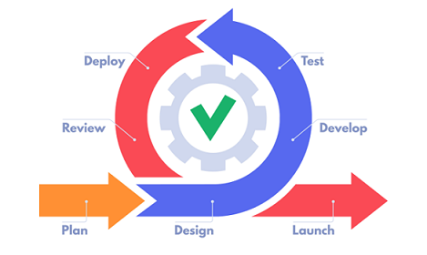

# Create your Kianda process #
You can create an end-to-end process quickly and simply in Kianda and use this prototype to develop your ideas through an iterative process. This **agile approach** results in significantly faster development time, that is cost effective and reduces risk.

***Agile development cycle***

The main phases of an agile project are:

1. Planning - this involves determining the scope of the project, what is it you want to achieve and what end-users will be supported and how. The outcome will be a list of requirements that can be adjusted as the process is developed.
2. Design - this involves construction of a draft of your product. Previewing the draft is included in this phase and there may be several rounds of revisions. 
3. Launch - this phase includes piloting the product with a number of users, monitoring results, getting feedback and then releasing the product including all related documentation.

Mapping these phases to process creation in Kianda, results in 3 main steps: **Plan > Design > Publish**. Each step contains 3 substeps as outlined below.

## Creating your Kianda processes in an agile way ##

Using Kianda allows you to leverage the agile development process to maximum effect:

1. **Plan** - our documentation will guide you when it's time for you to capture your requirements.

    What **forms** and **fields** will you need in your process based on what you want to do?

    What **rules** can be applied to create smart, automated processes?

    Who needs **access** to the forms as a user and form owner? Re-review these questions as you modify the process.
    

 2. **Design** - you can create drafts processes and restore to earlier versions allowing you complete control over production.

     Processes are made up of interactive **forms** which you can create at the click of a button.

     Forms connect to your **datasources** so as your organisation changes, your processes respond accordingly.

     Use the in-built **previewer** to preview and test your design, then save new versions as you modify design.
 

3. **Publish** - expand access to published processes as you become comfortable with the design.

    Allow individual user, group or partner access in order to **deploy** the solution in a controlled way.

    View key metrics in process **dashboards** to get insights into how to improve the process and the organisation.

    **Launch** and release the process, including documentation which can feed into future development projects.
   
   

### What's next   ###

Now that you are familiar with the development cycle, you can start to [**plan your process**](getting-started/plan_process.md) in Kianda.

If you already have your requirements mapped out, go straight to [**design your process**](getting-started/design_process.md) to get started in the Kianda **Designer**.

If you have coding experience and want to delve straight into how you can use Kianda to create your own widgets, go to **[Developer](getting-started/developer.md)** to learn more.

### **To return to the previous pages click on the links below**   

- [**Getting started guide**](getting-started/table_of_contents.md)
- **[Logging in to Kianda](getting-started/logging_in.md)**
- **[Personalise your workspace](getting-started/personalise_workspace.md)**

