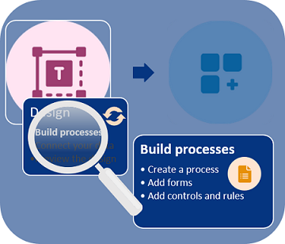
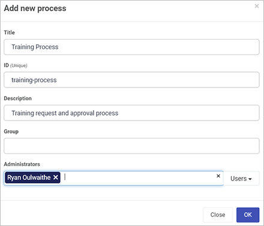

# Design and build your process

Kianda processes are made up of **forms**. As we saw in [Plan your process](getting-started/plan_process.md), you may have a paper forms or email flows that you want to turn into a dynamic, digital process. 

## Designing in Kianda

To turn your process plan into a Kianda design using the agile approach, follow three simple steps: [**Build processes**](#build-processes), [**Connect your data**](getting-started/dataconnect.md), [**Preview the design**](getting-started/previewer.md).

***Design process***

We'll start with the first step below, [Build processes](#build-processes).

## Build processes

Building processes involves three steps: creating the **process** itself, adding **forms** to the process and then adding **controls and rules** to the forms. 

***Build process steps***

Once you have previewed the design you may wish to go back and make changes to the form, adopting an iterative design approach. We will deal with each step in turn starting with [creating a process](#create-a-process). 

## Before you begin  

To start creating a process, reference your [process plan](getting-started/plan_process.md). In our example we will keep our Training Process [requirements](getting-started/plan_process.md#summary-of-requirements) in mind as we go. We will start by creating a first process called Training Process. 

## Create a process ##

1. To create a process, go to the **Side menu** and click on **Administration** > **Designer**.

2. You are now in the main process view. From here you can click on **Import** or **Export** to import or export processes when created. There is also an option to use Kianda's predefined processes available in the **App Store.** 

   ***Adding a new process***

   

   Click on the **Add new** button to create a process from scratch.

3. Fill out the details in the **Add new process** dialog box - that is **Title**, **ID** (a unique Name that autofills from the title), **Description**, **Group** (if you have a predefined group) and **Administrators**, people who will be able to administrate this process, choose from **Users** or **Groups**.

   ***Add new process dialog box***

   

    Click on **OK**  when complete.

4. You are now in the process design page. From here you can [Add forms](getting-started/create_form.md).

   ***Process design page***

   

### What's next   ###

The next steps are: 

- [**Add forms**](getting-started/create_form.md)
- **[Add controls and rules](getting-started/add_form_elements.md)**

### User tip  ###

There are many ways to manage who has access to a process, or form, see the video [**How to manage user access**](getting-started/how_to.md#how-to-manage-user-access).

### **To return to the previous pages click on the links below**   

- [**What is low-code development**](getting-started/low_code.md)
- [**What is no-code development**](getting-started/no_code.md)
- **[Create your Kianda process](getting-started/create_process.md)**
- **[Plan your process](getting-started/plan_process.md)**
- [**Designer**](getting-started/designer.md)

