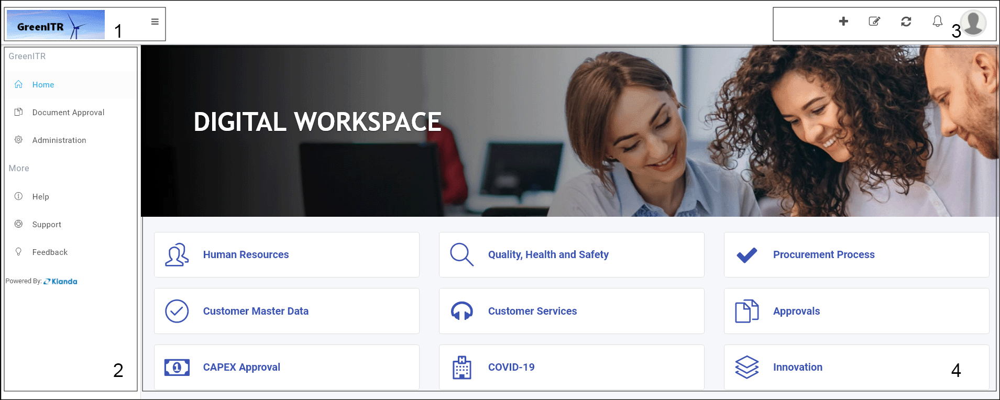
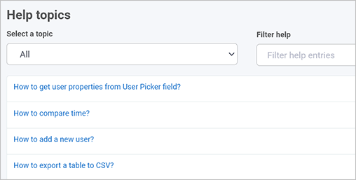

# Logging in to Kianda #

If your organisation already has a login, go to your given Kianda login page. If not, sign up for a free trial by going to https://app.kianda.com/signup. You will be prompted to confirm your email address and you can then login. The Kianda platform runs in the cloud, so you only need a web browser and can use any mobile device to login. 

When you login you will have access to the Kianda **workspace** where you can build end-to-end business processes, connect to data sources and view the results in real-time data dashboards.  

***Kianda workspace***

The layout of the Kianda workspace is as follows:

1. **Company logo** - the top left-hand corner is reserved for uploading company logos. If you click on the **Collapse navigation** button  you will see the collapsed version of the company logo and collapsed side menu, giving you more real estate in the central view panel.
2. **Side menu** - Beneath the logo is the left-hand pane, the side menu, containing all the key functions to create and manage your business processes. From this menu you will start **creating** **processes**. In the side menu, under **More**, there are links to get **Help**, **Support**, and give **Feedback**. From this menu you can also develop your own widgets, see [Developer](getting-started/low_code.md#how-to-get-started-with-developer) for more details.
3. **Quick Action menu** - the top right-hand menu bar contains shortcuts to keep you updated and allows you to **add dashboard pages**.
4. **Main view** - the central panel is the main view for any of the functions chosen from the side menu. Here you can **view and edit** processes and dashboards.

Go to [Personalise your workspace](getting-started/personalise_workspace.md) to find out to change the look and feel as well as regional settings for your workspace.

### What's next   ###

Learn how to [**create your first Kianda process**](getting-started/create_process.md), then follow the steps below:

  [**Plan your process**](getting-started/plan_process.md) 

  [**Design and build your process**](getting-started/design_process.md)

  [**Publish your process**](getting-started/publish_process.md)

If you have coding experience and want to delve straight into how you can use Kianda to create your own widgets, go to [**Developer**](getting-started/low_code.md#how-to-get-started-with-developer) to learn more.

### User tip  ###

If you need **help** at any stage, go to the **Side menu** > **More** > **Help**. This will bring you to the Help section where there are a list of searchable FAQs with topics that contain instructions and short help videos.

***Help pages***

 

There are also a series of short '[**How to videos**](getting-started/how_to.md)' designed to help you.

### **To return to the previous pages click on the links below**   

- **[Getting started guide](getting-started/table_of_contents.md)**
- **[Welcome to Kianda](getting-started/welcome.md)**