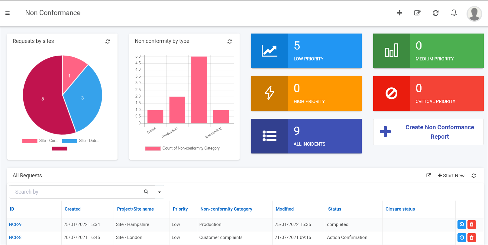

# Security #

Kianda is committed to delivering a best-in-class solution to our clients and place security at the core of our offering. 

In terms of security and quality, Kianda's services and solutions are **ISO27001:2013 certified and audited by external parties**, so you can be confident that we follow best practice for our client’s data and information security.

The Kianda Platform is a solution that is SaaS cloud-based, and allows for integration to multiple third-party IT systems / siloed data sources, for example SharePoint Online Environment and Active Directory, SAP, SQL Server, O365 and Oracle to name a few. 

## Quality Assurance   ##

In order to ensure Kianda meets the highest quality assurance levels, there are a number of methodologies employed, including: 

- Kianda is **ISO 27001 ISMS certified** and audited by an external party every 6 months. Details may be accessed here: https://www.kianda.com/information-security. 
- Kianda follows agile methodologies for management of product development and project deliveries. Team members are certified in Agile Project Management and Scrum Framework, ensuring we deliver best practice project documentation and product development cycles. 
- Kianda’s Information Security Management System (ISMS) policy is designed to protect Kianda’s information assets as well our clients’ information from all threats, whether internal or external, deliberate or accidental, to provide a security approach that satisfies our clients, solid understanding of security requirements and risk management practices and effective communication of security to all Kianda employees, contractors, partners, clients and third parties. 
- Kianda’s Information Security Policy ‘Security in Development and Support Processes' covers Patch Management Processes, Technical Review of Operating System Changes Restrictions on Changes to Software Packages and Product Development stages. 
- Kianda regularly backs-up adequate copies and generations of all software, documentation and business information. Regular testing is carried out to ensure the quality and usability of backed-up resources.  

The Kianda Platform **fully complies with General Data Protection Requirements** (GDPR) and is being continually improved, with an enhancement roadmap in place. 

  

### Security and Authentication ###

The Kianda platform **provides Single Sign On (SSO)** capability with SharePoint or OneLogin. This allows users to create, view and approve forms by first logging in with their Active Directory (AD) account. 

Security is provided by integration with the Clients Active Directory / O365 or other Multi-Factor Authentication (MFA) requirements. It can synchronise users and their groups from SharePoint, O365 or AD. The platform provides the ability for external users to integrate with SSO and MFA authentication via guest users in O365. 

Kianda can be linked with active directory groups set up by the client to control permissions. The system can synchronize with the existing permissions from AD. 

### User Management ###

The Kianda platform allows for **different users to have different security privileges**, providing for easy administrative management of users and their access rights. Our platform allows the following user levels by default:

- User (can only access what is assigned to them) 
- Administrator (can access all) 
- Manage partners/customers (can only access what is required to manage customer portals) 
- Design business process (can only design business forms and workflows) 
- Manage data sources (can only manage data sources and connections) 
- Developer (can design new widgets within the platform) 

The platform allows for the creation of user groups and the ability to assign these user groups to processes or dashboards as needed. Dashboard levels or particular widgets can be configured to be visible to certain users or groups of users, plus, data source connections can be configured in the same way to ensure the highest access control levels. 

Our data classification system has been designed to support access to information based on the need to know, so that information will be protected from unauthorised disclosure, use, modification, and deletion. 

The Kianda platform ensures that data is never transmitted in clear text or stored in a database or file solution. The platform is hosted in MS Azure with enterprise-grade security. All data generated is encrypted at rest and in transit. Data records are also masked from a GDPR point of view. We employ Microsoft security products to automatically mask and classify personal data - which is scheduled weekly. 

Overall, Kianda Technologies follows ISO ISMS policies, GDPR best practices and Open Web Application Security Project (OWASP) guidelines for product development. Kianda Technologies will also adhere to Client security standards. 

### Ease of use ###
The Kianda Platform offers administrative interfaces that are private and segregated from user interfaces. 

Kianda forms by default, provide edit and reassign functions that are only available to admin users or configurable roles within the system. These quick actions allow admin users to make changes to an existing form record when needed. Any **changes made** **by** **any user are logged** in the Audit History. 

In terms of designing new forms or making changes to existing designs, admin users have the ability to preview their changes before publishing within the design interface. Only after publishing, changes become visible to end-users.  In addition **live and test environments are provided** to enterprise clients, providing the ability to test in the test environment before publishing to live. 

For further ease of use, error messages are configurable within the Kianda platform. They can be created freely when forms are being designed to ensure scenarios such as data validation or indicating the next course of action. This gives the flexibility to form designers to define error messages as needed.  

Kianda training is delivered by technical experts and trainers with a deep understanding of the platform, ensuring that the training experience is optimised and it is easy to learn how to optimally use the platform. Projects are structured so that Clients’ appointed staff are involved during the whole journey of project execution. This facilitates knowledge transfer and an “on-the-job” training approach and includes specific training sessions that are run before and after solution delivery.  

## Dashboards and reporting ## 

The Kianda platform allows admin users to personalise dashboards based on the unique needs of users or user groups based on hierarchy, for example only project managers see their forms status and admin users may see the full picture. 

Multiple dashboards can be created and customised as required per project, per department or other configurations. **Access to the dashboards can be set at a high level for the entire dashboard or certain links**, lists or widgets in a dashboard and can be made accessible to certain user groups defined in the system. 

***Dashboard page***

Examples of our dashboard features are: 

- Number of forms awaiting approval 
- Number of completed forms per week/period/quarter 
- Split dashboards by type or department 
- Columns to cater for “requested by”, “date of request”, “pending approval from”, “approved by”, “rejected by” 
- An alerts section to highlight approvals that have been pending past X number of days 
- Designing layouts to group certain fields 
- Charts, Lists, Links, Tiles and Rich Text are available dashboard widgets 

The Kianda platform allows users to report on different forms within a SharePoint site (or other relevant data source), as well as for a particular form library. In addition, the platform allows reporting across multiple form libraries, SharePoint Sites, and SharePoint Site Collections. Our reporting capability goes way beyond reporting from SharePoint data, and allows **combining** of data from multiple data sources for reporting purposes.  

### Audit history ###

Kianda logs and makes available all security-related events within the Audit History of each record to administrative users. Also, system logs can be made available when required. 

By default, all the forms and processes created in our platform come with **detailed read-only Audit History**. Audit logs are created for any modifications made to records automatically and are only available to configured roles to view. Our platform allows for the set-up of an “auditor role”, with read-only access, to allow an auditor to run reports and check audit logs. 

Admin users can configure optional record level viewing logs. The recording of audit logs is automatic for any changes in the forms which gives detailed field level auditing information.  

The Kianda Platform integrates with SharePoint which provides IRM (Information Rights Management) features that enables the tagging of certain data or documents not to be printed or emailed and so on.

## Support and security updates ##
Within the Kianda platform, administrative users and general users can report any queries or issues using the **support ticket** menu option available. Our platform is updated with 1 major release per year and patch/security releases multiple times during the year, which includes security updates. These are communicated with clients in advance. 

We provide multi-levels of data recovery. That includes data version history of records, recycle bin feature and ability to recover from a point in time, backups with a time window of every 10 mins. 

Our platform supports **99% uptime**. We provide 99% availability, availability is calculated with the exception of scheduled maintenance. 

Our services are available 24 hours a day, 7 days a week, excluding planned downtime. We expect planned downtime to be infrequent but will endeavour to provide customers with advance notice. If our systems fail, we treat this as a critical high priority with an impact on our business continuity. We will do everything possible to solve the issue as soon as possible. Our web services use highly available services with **geo-redundancy** enabling a failover to another European region in the event of emergency.

### **What's next**   

To learn how to start using the Kianda environment, go to [**Logging in to Kianda**](getting-started/logging_in.md).

### **To return to the previous page, click on the link below** 

- **[Welcome](getting-started/welcome.md)**

