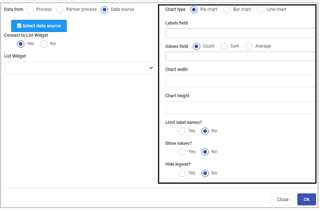
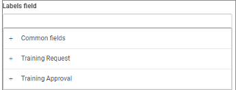

# Chart configuration #

When you choose the Chart widget for your dashboard, there are a number of options to configure the chart so that it looks the way you want. 

1. Click on the **Pen** button  in the widget you have created to see the fields used to edit the chart, visible in the right-hand pane.

    

2. Choose from the edit options:

   - **Chart type** - choose from a) Pie chart b) Bar chart c) Line chart

   - **Labels field** - click into the field to drill down to the find what you want to use. You can use **Common fields** such as Status and Created, commonly used in dashboards, and use **design fields** that are part of processes attached to forms, for example fields within the forms Training Request and Training Approval below.

     

     

   - **Values field** - choose from a) Count b) Sum c) Average and click into the field itself to drill down to the fields you want, as with the **Labels field**.

   - **Chart width** - use the arrow to choose a numeric value...

   - **Chart width** - use the arrow to choose a numeric value...TO COME BACK TO

   - **Chart height** - use the arrow to choose a numeric value...TO COME BACK TO

   - **Limit label names** - options are a) Yes or b) No TO COME BACK TO

   - **Show values** - options are a) Yes or b) No TO COME BACK TO

   - **Hide legend** - options are a) Yes or b) No TO COME BACK TO

3. Click on the **OK** button when you are finished editing to save your changes or click on **Close** to exit the dialog box without saving.

4. To change the chart settings, that is the way the chart looks, title and so on, click on the **Settings** button and go to [Chart](#chart.md) to find out more about edit options.

5. When you are finished making edits to your widget, click on the **Save** button  in the top menu to ensure your dashboard changes are saved and you will see a pop-up message **Page saved successfully**.

6. To make further changes later on, click on the **Edit** button  in the top menu and then click on the **Pen** button.

    

   Go to [Chart](#chart.md) to find out about data connection options. 

   