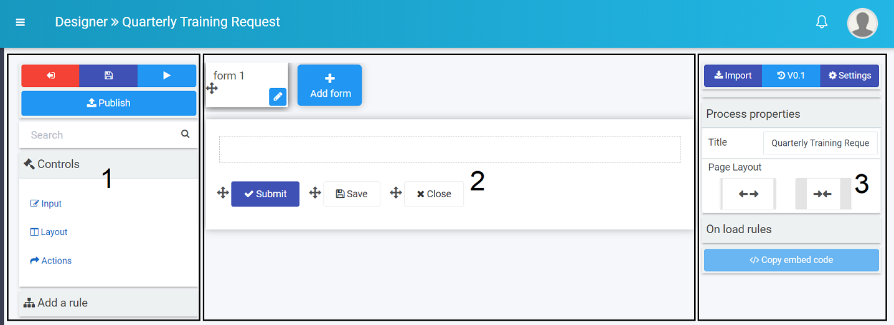
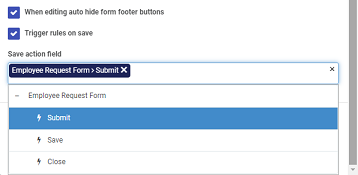
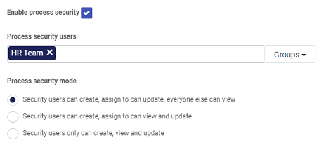

# Form Designer

Kianda form **Designer** provides an intuitive interface where you can quickly start building **forms** for any use case.

From the main process view, double-click on any process and the form designer window opens.

The key components of the form designer are:

1. Left-hand pane contains both **controls** and **rules** that can be added to forms. Go to [Controls](fields/README.md) and [Rules](rules/README.md) to find out more. 

2. The central area is where the current **form canvas** is displayed.

3. The right-hand pane is where the **properties** and **rules** are displayed for the selected item.
Note that the name of the process you are working on is shown in the top menu bar, for example Training Request. 

4. At any time you can go back to the process list by clicking on Exit process designer button  .

## Getting started with forms

1. How you get started with forms depends on:

   - If you have created a process using the App Store, see [Predefined forms](#Predefined forms)

   - If you have created a process from scratch, see [New form](#New form)

   - If you import forms, see [Import forms](#Import forms)

2. Once your form is created, there are a number of actions you can perform, see [Settings and Properties](#Settings and Properties). 

   

### Predefined forms ###

1. If you have created a process using the App Store, then a number of forms will already be part of the process. For example the process Security Incident Management has 5 forms attached: Incident detail, Data breach, Malware outbreak, Root cause remedy and Caller review. Click on [Kianda Apps](platform/appstore.md) to find out more about other apps in the App Store. 

2. You can simply click on a form and click on the Pen button to edit the form details. You can also click on the **Add form** button to add a new form. Edit options are shown under [New form](#New form).

   

### New form ###

1. If you have created a process from scratch, an empty form is added to your process by default. Click on this form and the Pen button to customise it. You can also click on the **Add form** button to add a new form. 

   

2. Choose from the edit options:

   1. **Title** - of the form, for example Employee Request Form

   2. **Name** - this is a unique name for the form

   3. **Default owner(s)** - by default the form creator is an owner. You can remove this user by clicking on x and add other owners by clicking on the arrow and choose from **Users**, **Groups** or **Partners**. 

      - Users - allows you to choose individual owners
      - Groups - allows you to choose from defined groups for example HR Team or Management Team
      - Partners - TO COME BACK TO

   4. **Activate with** - TO COME BACK TO

   5. **Submit mode** - options are a) Only this form or b) All forms in edit mode

   6. **Form icon** - click on the arrow to choose from hundreds of icons to attach to your form.

   7. **Form theme** - choose from Navy, Green, Blue, Amber, Red or White Colours for your form.

   8. **Enable quick actions** - if you tick the box, you can select from the options a) Enable re-assign b) Enable edit and c) Enable custom action. Click on Ellipsis button to further modify the action settings. I

      - If you click on **Enable re-assign**, you can reassign action settings to particular Users, Groups or Partners. Click on **Allow form owners** if you want form owners to be able to reassign actions.

      

      - If you click on **Enable edit**, you can allow certain Users, Groups or Partners to edit the form, along with form owners by clicking on **Allow form owners**. 

        Other options include a tick box **When editing auto hide form footer buttons** and **Trigger rules on save**. Click on the Save action field bar to choose from actions: **Submit**, **Save** or **Close**. 

        

      - If you click on **Enable custom action**, you can allow certain Users, Groups or Partners to edit the form, along with form owners by clicking on **Allow form owners**. 

        Other options include **Action label**, Target action field and **Action display mode**, for example **Read-only mode**, **Edit mode** or **Both**.  TO COME BACK TO

     

3. Click on the **OK** button  when you are finished editing or click on **Close** to exit the dialog box.

4. To save your changes to the form, click on the Save button . You can also implement additional settings see [Process Settings](#Process Settings).

5. You are now ready to start adding **controls** and **rules** to your form. Go to [Controls](fields/README.md) and [Rules](rules/README.md) to find out more. 

   

### Import forms ###

1. You can import a previously designed form by clicking on the Import button .

2. Click on the arrow to select from the drop down list to **Select a process design**. 

3. Click on a process of interest and then click on the forms and fields to import. Forms are indicated by a + symbol and can be expanded to show elements within a form like a panel containing different fields like lists and text boxes. 

   

   In this way you can very quickly reuse some or all parts of an existing form. 

4. Click on the **OK** button  when you are finished editing or click on **Close** to exit the dialog box.

 ## Settings and Properties ## 

In addition to the edits above, there are a number other actions and settings that you can implement to your process and forms. 

These are on view in the right-hand pane and give you the ability to:

- View [Design version history](#Design version history)

- Change [Process settings](#Process settings)

- Create a duplicate form by selecting a form, clicking on the Clone button and then click on **Ok**. A version called 'Form Name Copy' is created and available to edit on the canvas. 

- Edit form information by selecting a form and clicking on the Pen button .

- Delete a form by selecting a form, clicking on the Bin/Trash button  and then click on **Ok** after you have reviewed the form title and you are sure this is what you want to delete. Click on **Cancel** if you wish to cancel the deletion.

- View and edit [Form properties](#Form properties)

  

### Design version history ###

The **current version** of a process is always visible in the right-hand pane, for example V0.1 as shown below.

The **first version** of a process is **0.1** and will increment to 0.2 and so on, each time a process is saved. Once the process is **published** the version changes to **1.0** and increments with each publication. This makes it is easy to keep track of who and when changes were made and to restore an older version if needed. 

1. To view the version history click on the Design version history button  .

2. A pop-up shows the version history details including when the version was created and who created it. 

   

3. Click on a particular version to see the version information, for example forms, fields and rules that were added,  modified or removed.

4. Click on the Restore button  beside a particular version and then click on **Ok** to confirm that you want to restore to that version. 

### Process settings

You can edit process settings by clicking on the **Settings** button in the right-hand pane. 

Choose from the settings:

1. **Process id settings** - choose from a) Default or b) Custom and use a combination of [ProcessName]-[UniqueNumber]-[FieldName]

2. **Enable process security** - if you tick the box, can allow certain Users, Groups or Partners to have certain privileges related to the radio button options to create, assign and view as shown below.

   

   The default setting is **Security users can create, assign to can update, everyone else can view**.

3. **On load rules execution mode** - options are a) Always b) When in edit mode or c) When open new. The default setting is **Always**. TO COME BACK TO

4. **Hide form tabs** - options are a) Yes or b) No TO COME BACK TO

5. **Hide left nav** - options are a) Yes or b) No TO COME BACK TO

6. **Enable anonymous sharing of forms** - options are a) Yes or b) No TO COME BACK TO

7. **Enable mobile bottom navigation** - options are a) Yes or b) No TO COME BACK TO

8. **Instance delete settings** - options are a) Any user can delete b) Creator can delete c) "Current form owner" can delete d) "Security users" can delete e) "Admins only" can delete. The default setting is **Creator can delete**.

9. **Enable form assignment notification** - options are a) Yes or b) No TO COME BACK TO

10. **Prevent closing instance with unsaved data** - options are a) Yes or b) No

11. **Selected tab theme** - choose from Navy, Green, Blue, Amber, Red or White as a colour when a form is selected.

12. **Completed tab theme** - choose from Navy, Green, Blue, Amber, Red or White as a colour when a form is completed.

13. Click on the **OK** button  when you are finished or click on **Close** to exit the dialog box. 

