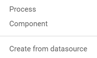

## Getting started with Kianda processes

The power of Kianda lies in giving anyone the ability, even those without coding experience, to design a business application or process quickly and efficiently. This process could be a Quality Assurance checklist that installation engineers must follow on site using an application on their mobile phone or it could be a HR process to allow employees to submit annual leave requests and approve these online. Processes can connect to your data sources like Sharepoint or SalesForce allowing for the flexibility of your applications to grow as your business grows.

Each process comes with **dashboards** so you can see at a glance, for example, how many leave requests were submitted, approved and so on. And you can customise all of these processes the way you want.

Before you begin, we at Kianda recommend doing some simple planning before you design your process. It could be something as simple as a quick flow chart or a spreadsheet where you quickly log the key components, fields or rules that should be needed in the process. Watch this video to give you some ideas about what is possible with Kianda and how you can use these features in your process design.

Insert video

1. To start creating your first process, go to the left-hand pane and click on  **Administration** > **Designer**

2. Click on the **Add new button** found beside Process Design. Note that if you click on the arrow on this button you have options to create a Process, a Component or to Create from datasource.

   

3. Choose from the edit options:

   - **Title** - of the process, for example Annual Leave Approval

   - **ID** - this is a unique name for the field

   - **Description** - a description of the process

   - **Group** - TO RETURN TO

   - **Administrators** - choose from a) Users or b) Groups

     These are the users or groups who will act as administrators for the process, for example to edit or delete the process. For example if you click on **Users** and click in the Administrators field you will see a list of all the users who are approved to administrate this process.

     

4. Click on the OK button  when you are finished editing the process. 

5. Your process is now available to start editing. Go to [Form Designer](platform/form_designer.md) to find out more on how to edit your process.

   

