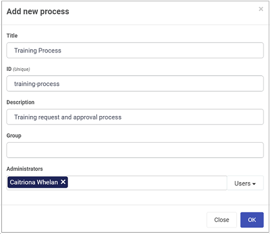
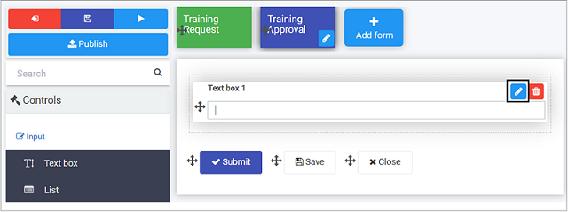

# Design and build your process

Kianda processes are made up of **forms**. As we saw in [Plan your process](#processplan.md), you may have a paper forms or email flows that you want to turn into a dynamic, digital process. 

To turn your process plan into a Kianda process, follow 3 simple steps:

> 1. [Create **forms**](#create-forms)
> 2. [Add **form elements**](#add-elements)
> 3. [Connect to **datasources**](#connect-to-datasources)

We will follow the steps above using the Training Process example found in [Plan your process](#processplan.md), keeping the design below in mind as we go.

## Create forms ##

1. Go to the side menu and click on **Administration** > **Designer**.

2. You are now in the main process view. From here you can click on **Import** processes, **Export** processes when created or use the Kianda predefined process in the **App Store.** Click on the **Add new** button to create a process from scratch.

   

3. Fill out the details in the **Add new process** dialog box - that is **Title**, **ID** (a unique Name that autofills from the title), **Description**, **Group** (if you have a predefined group in mind) and **Administrators**, people who will be able to administrate this process, choose from **Users** or **Groups**. Click on **OK** when complete.

   

4. You are now in the process design page. From here you can add **forms** and form elements. 

   

   There are 3 areas in this page:

   1. Left-hand area to add form elements like **controls** and **rules**.
   2. Central **form canvas** that displays the current form you are working on.
   3. Right-hand area to view and edit process and form **properties**.

   By default a first form "form1" is added to your process. Click on the **Pen** button   to start editing this form. 

8. Fill out the details in the **Edit form** dialog box - that is **Title**, **Name**, and **Default owner(s)**, people who will be able to administrate this form, choose from **Users** or **Groups**. There are other options like **Form theme** which are colours that you can apply to the form tab. These options are explained in further details in [Form Designer](platform/form_designer2.md). Click on **OK** button when complete.

   

8. The changes made to the first form are visible in the form canvas. Click on the **Add form** button to add a second form.

   

7. Once you have added one or more forms, you are ready to [Add form elements](#add-form-elements) to your process!

   

## Add form elements ##

Form elements are made up of **Controls** and **Rules** and are available from the left-hand pane. 

1. Click on a form that you want to edit, for example Training Request is selected above, as the **Pen** button   is visible.

2. Click on **Controls** in the left-hand pane. There are 3 categories of Controls: Input, Layout and Action depending on what you want to add. See [Controls](#controls) for a full listing of what is available. Click on a particular category, for example **Input** and then click on a particular field type to add, for example **Text box**.

3. The field is added to the form. To edit the field, as with the form itself, click on the field so the **Pen** button   is visible.

   

4. Fill out the details in the **Edit field** dialog box - that is **Title**, **Name**, and choose options further options like **Mode** to have users input a **single line of text**, **multiple lines of text** or **rich text**. 

   

   There are other options like **Text style** where you can choose to Capitalise or have lowercase text only. Go to [Text box](fields/input/textbox.md) for more details. Click on **OK** button when complete.

5. sdf

   

6. sdfsf

   

   

   

   

   

   

   

### Controls  ###

**Expressions** can also be used to manipulate data, for example to return a particular value 

**When you click on a process from the Process design view** 

### **Create a process workflow**

### **Test your workflow** ###

