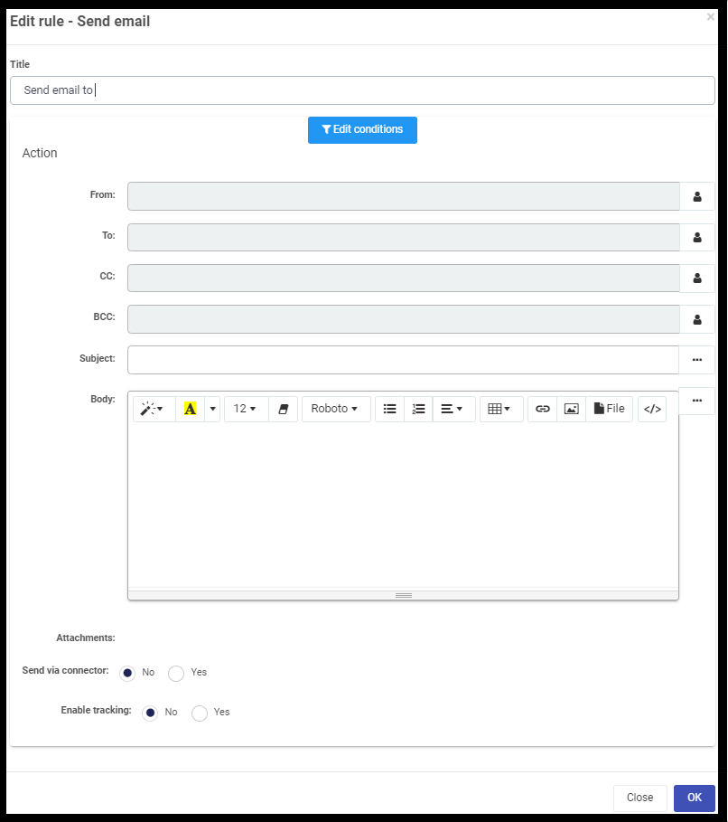

# Send email #

This rule sends an email according to a predefined template.  Each element of the email is configurable.  The body of the email can include text and images.  Data stored in fields in the current form can be copied in dynamically.  It is also possible to add attachments to the email.

## When to use the Send email rule

You can add this rule:

- [x] to a field
- [x] to a form 
- [x] to a process (the rule will run on load)

## Before you get started ##

Before you set up a 'Send email' rule you need to decide who will the email be from, for example a no-reply type email, who the email will be to, 

## **How to get started**

1. Click on an existing process by going to **Administration** > **Designer** and then click on **Rules** > Communications > Send email. 

2. Choose from the edit options:

   1. **Title** - of the email for example 'Send email to Training Managers'

   2. **Edit conditions** - click on the **Edit conditions** button  create conditions to send the email, for example based....

   3. **From** - who the email is from, click on Person button 

   4. **Help text** - information to help the form user

   5. **Mode** - options are a) Single line of text b) Multiple lines of text c) Rich text

      If you choose a) Single line of text then the following additional options are visible:

      ​		**Control type** - options are a) Text b) Password

###### How to use
To send an email when the user submits a form:
1. Before adding the rule: 
   a. Add a name field to the current form: Click on Controls > Input > Text box and drag the field onto the form.  Edit the field by clicking on it and then clicking the pen icon. Change the Title to *Name*.  Change the Name(unique) to *name*.  
   b. Add an email address field to the current form: Click on Controls > Input > Text box and drag the field onto the form.  As before, change the Title to *Email address* and change the Name(unique) to *emailAddress*.  
2. Click on the Submit button.
3. Select Add a rule > Communications  > Send email.
4. Click on the person icon in the To: field.  Select Email address in a field and then you will be able to choose the text field with the email address which you added earlier.
5. Add some text to the Subject field. This field cannot be empty.
6. In the Body field, add some text: note that you can change the font size, add images etc.. 
7. Open the Expression builder (using the button on the right with three dots). Under Add field to expression, find the Name field which you added earlier.  Click on Add to expression.  You will see your name field listed as [name] in the Expression window.  Click OK.
8. Click OK to exit the rule. 

> **Warning** 
>
> If you add an email address to the From field then you must specify an Email connector.  See below.

###### Notes

**From:** If you leave this field empty (see example above), the email will be sent from noreply@kianda.com.  If you want your email to come from a different sender, follow these steps when you are editing the Send email rule:

1. Set Send via connector to Yes.  
2. Select an Email connector and click OK.

Note that this will override the global Email connector setting if one has been configured for your system.  Go to Administration > Subscription > Subscription Details to check for a global setting. 

**Filling in email addresses for the fields From: To: CC: and BCC: **
When you click on the person icon on the right hand side of one of these fields, you need to choose the Selection mode from the following options:
* Any user or partner: choose the user or partner (email address) from the Selected users list
* User(s) defined in a user field: choose the field where the user (email address) is stored
* Form owner(s): choose the form and the owner(s) (email address) will be selected
* Email address in field: either choose the field where the email address is stored or type in the email directly.

**Switching to HTML in the Body**
You can write text directly into the Body of the email.  If you want to view or edit the HTML, click on the Code View button (</>).  

**Attachments**: Files can be attached to the email.  First the file must be stored in a File field in one of the forms.  Open the Send Email rule and find the File icon in the Body field menu.  Click in the File field to find the field where the file is stored. Click on Insert attachment.  There is an option to attach a link to the file rather than the file itself.

**Enable tracking:** 
* This option allows you to track the email after it is sent. The following events are tracked: Open, Click, Bounce, or Spam.  
* The option is only available if Send via connector is set to No and the email is being sent from noreply@kianda.com. 
* If you click Yes to Enable tracking then you must have a field to store the event.  Select the field here.  